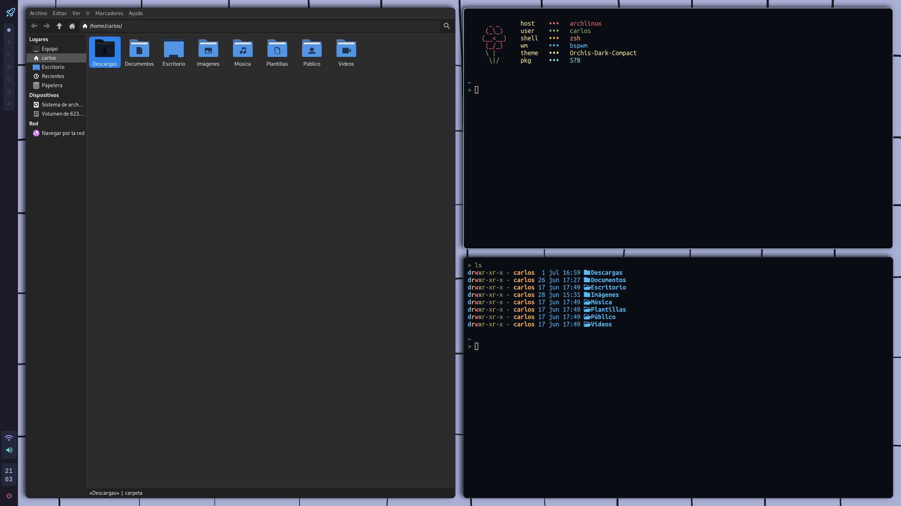
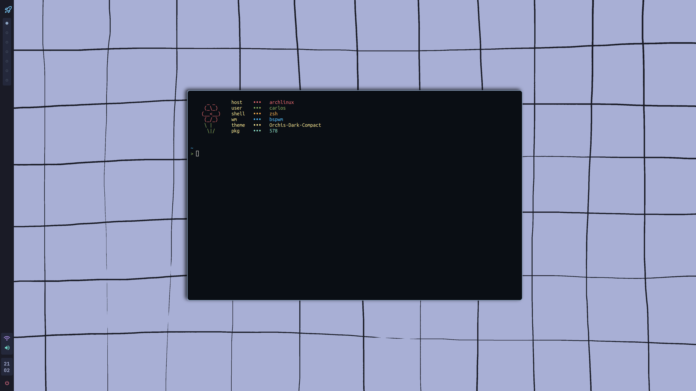
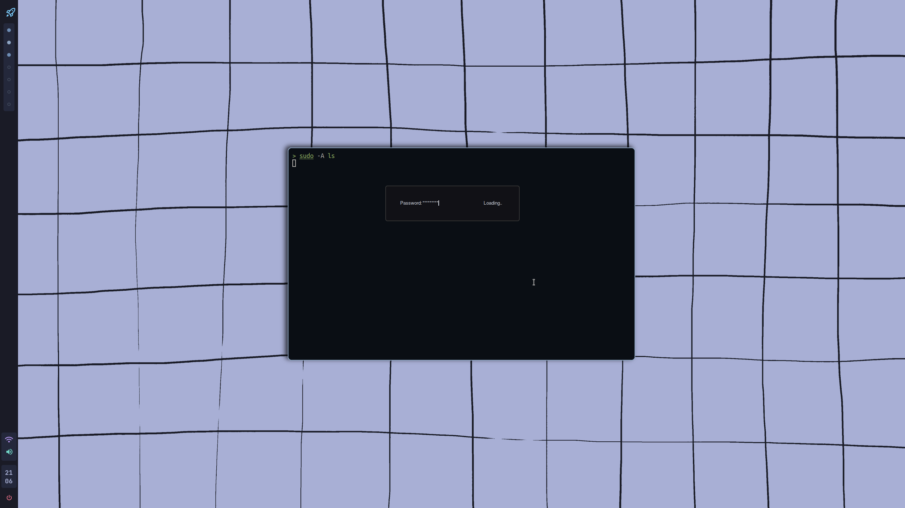
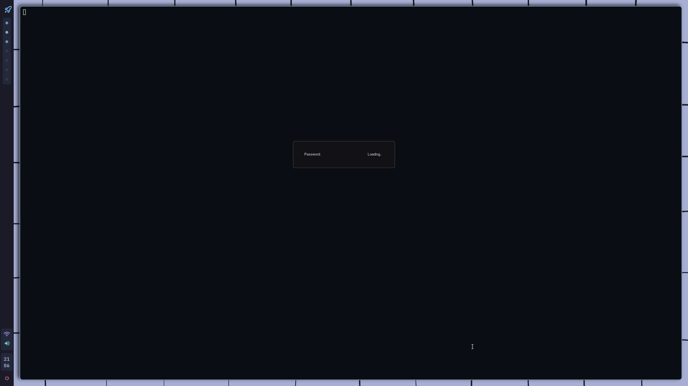

# Pineedaa's dotfiles
## Screenshots





# Apps

- OS: [ArchLinux](https://archlinux.org/)
- WM: [BSPWM](https://github.com/baskerville/bspwm)
- Terminal: [Alacritty](https://alacritty.org/)
- File explorer: [Thunar](https://wiki.archlinux.org/title/Thunar)
- Menu: [Rofi](https://github.com/davatorium/rofi)
- Shell: [Zsh](https://www.zsh.org/)
- Fetch: [Flowetch](https://github.com/migueravila/Flowetch)

The necessary packages for this environment can be installed with:
```
yay -S \n
# Terminal
alacritty \n
# For flowetch
bc \n
# Keybind for brightness
brightnessctl \n
# Notifications
dunst \n
# Shell
zsh \n
# For the .zshrc
eza \n
# Screenshoter
maim \n
# Theme
orchis-theme \n
# Menu
rofi \n
# Set wallpaper
feh \n
gtk \n
gtk2 \n
gtk3 \n
gtk4 \n
# Icons
epapirus-icon-theme \n
# Cursor
xcursor-comix \n
xorg-xsetroot \n
# Fonts
ttf-ubuntu-mono-nerd \n
ttf-jetbrains-mono-nerd \n
# Adjust volume with the scripts
pactl \n
pamixer \n
# Bar
eww \n
# Compositor
picom-arian8j2-git \n
# Screenlocker
betterlockscreen
```

# Install

You can clone this dotfiles where you prefere and inside the folder you can simply execute `stow .`.
You can install the [stow](https://www.gnu.org/software/stow/manual/stow.html) package with pacman:

`$ pacman -S stow`

# Theme

The theme I chose is [orchis-dark-compact](https://aur.archlinux.org/packages/orchis-theme) and it can be installed with [yay](https://aur.archlinux.org/packages/yay):

`$ yay -S orchis-theme`

And the icon pack is [papirus]() that can be installed with pacman:

`$ pacman -S epapirus-icon-theme`

The theme, icon pack and font can be applied with the [lxappearance](https://archlinux.org/packages/extra/x86_64/lxappearance/) package.

# Bar

The bar is made with [eww](https://github.com/elkowar/eww). It is a fork of [rxyhn](https://github.com/rxyhn/tokyo)'s dotfiles.


# Sudo askpass

There is also an script and an environment variable that is used to ask your sudo password without having to interact with the terminal. That is really useful when you want to open an app or execute an script with sudo permissions but from a .desktop file.

To see how it works execute ´sudo -A \<command to execute\>´



This is useful when you want to create a cli app that requires admin privileges and you don't want it to be executed via terminal.
For example you can create a .desktop file to execute and app/script that needs sudo permissions and asks you for the password with the rofi menu.




For the askpass to work you must set the SUDO_ASKPASS variable to a binary or script that returns the password in the stdout.
In my case I export the variable in the autostart script of BSPWM and it is set to `$HOME/.config/bspwm/scripts/askpass`. When you have this variable set it will use automatically this path to the script to ask the password.
