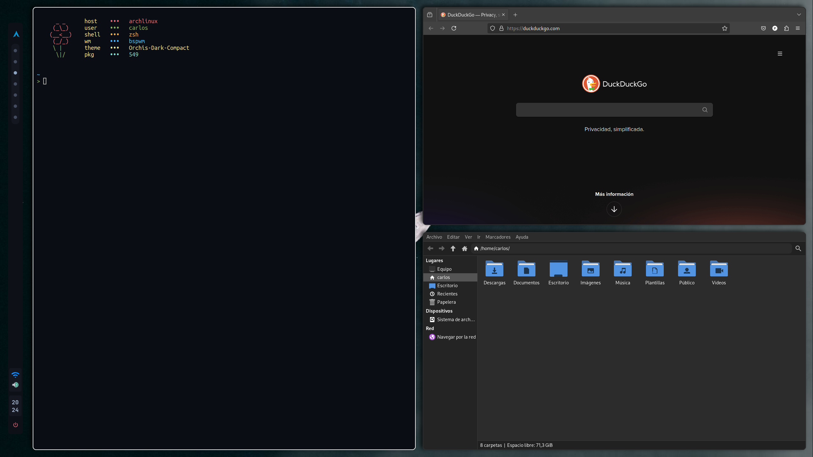
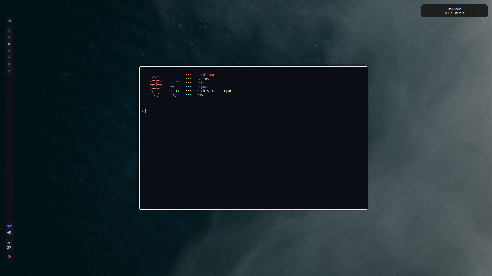

# Pineedaa's dotfiles
## Screenshots





# Apps

- OS: [ArchLinux](https://archlinux.org/)
- WM: [BSPWM](https://github.com/baskerville/bspwm)
- Terminal: [Alacritty](https://alacritty.org/)
- File explorer: [Thunar](https://wiki.archlinux.org/title/Thunar)
- Menu: [Rofi](https://github.com/davatorium/rofi)
- Shell: [Zsh](https://www.zsh.org/)
- Fetch: [Flowetch](https://github.com/migueravila/Flowetch)

The necessary packages for this environment can be installed with:
```
yay -S \n
# Terminal
alacritty \n
# For flowetch
bc \n
# Keybind for brightness
brightnessctl \n
# Notifications
dunst \n
# Shell
zsh \n
# For the .zshrc
eza \n
# Screenshoter
maim \n
# Theme
orchis-theme \n
# Menu
rofi \n
# Set wallpaper
feh \n
gtk \n
gtk2 \n
gtk3 \n
gtk4 \n
# Icons
epapirus-icon-theme \n
# Cursor
xcursor-comix \n
xorg-xsetroot \n
# Fonts
ttf-ubuntu-mono-nerd \n
ttf-jetbrains-mono-nerd \n
# Adjust volume with the scripts
pactl \n
pamixer \n
# Bar
eww \n
# Compositor
picom-arian8j2-git \n
```

# Theme

The theme I chose is [orchis-dark-compact](https://aur.archlinux.org/packages/orchis-theme) and it can be installed with [yay](https://aur.archlinux.org/packages/yay):

`$ yay -S orchis-theme`

And the icon pack is [papirus]() that can be installed with pacman:

`$ pacman -S epapirus-icon-theme`

The theme, icon pack and font can be applied with the [lxappearance](https://archlinux.org/packages/extra/x86_64/lxappearance/) package.

# Install

You can clone this dotfiles where you prefere and inside the folder you can simply execute `stow .`.
You can install the [stow](https://www.gnu.org/software/stow/manual/stow.html) package with pacman:

`$ pacman -S stow`
